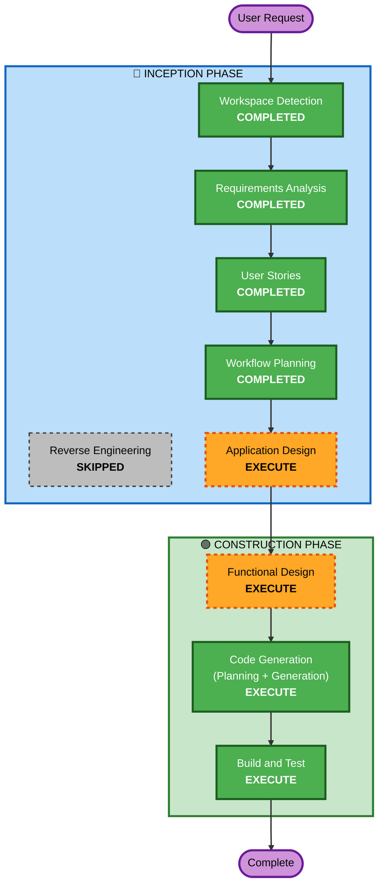

# Execution Plan

**Feature**: Instalment for Claim Recovery - Scheme Configuration
**Spec ID**: SPEC-39336
**Date**: 2026-05-06

---

## Detailed Analysis Summary

### Transformation Scope
- **Transformation Type**: Multi-component enhancement within monolithic application
- **Primary Changes**: New business logic for claim recovery instalments, schema extension, UI modifications
- **Related Components**: Claims Management, Sirius Back Office Core, GIS/Product Builder, Database (PFScheme), Navigator XM

### Change Impact Assessment
- **User-facing changes**: Yes — new checkbox in Product Risk Maintenance, new Scheme Type option, new Transaction Type options, new instalment creation workflow step
- **Structural changes**: No — extends existing architecture patterns, no new components created
- **Data model changes**: Yes — new `scheme_type` column on PFScheme, CHECK constraint, extended stored procedures
- **API changes**: No — no REST/WCF API changes
- **NFR impact**: Minimal — uses existing patterns (event_log, dPMDAO, stored procedures)

### Component Relationships
- **Primary Components**: Claims Management (gCLMLibrary), Sirius Back Office Core (instalment scheme maintenance)
- **Configuration Components**: GIS/Product Builder (Product Risk Maintenance)
- **Data Layer**: PFScheme table, `spu_PF*` stored procedures
- **Workflow**: Navigator XM claims recovery roadmap

### Risk Assessment
- **Risk Level**: Medium
- **Rollback Complexity**: Moderate (database migration requires rollback script)
- **Testing Complexity**: Moderate (cross-component, backward compatibility verification)

---

## Workflow Visualization

---

## Phases to Execute

### 🔵 INCEPTION PHASE
- [x] Workspace Detection (COMPLETED)
- [x] Reverse Engineering (SKIPPED — existing `.ai/memory/` context is current)
- [x] Requirements Analysis (COMPLETED — 18 FRs, 6 NFRs, 17 ACs)
- [x] User Stories (COMPLETED — 8 stories, 3 personas, 31 story points)
- [x] Workflow Planning (COMPLETED)
- [ ] Application Design - EXECUTE
  - **Rationale**: Multiple components involved (Claims, Back Office Core, GIS/Product Builder). Need to define component interfaces, method signatures, and service coordination for the new recovery instalment workflow. Existing components are being extended with new responsibilities.
- [ ] Units Generation - SKIP
  - **Rationale**: Monolithic WinForms application — no independently deployable units. All changes are within the single Pure Insurance application with logical modules.

### 🟢 CONSTRUCTION PHASE
- [ ] Functional Design - EXECUTE
  - **Rationale**: Complex business logic requiring detailed design: scheme selection algorithm, rate application logic, recovery type identification, duplicate prevention validation, backward-compatible stored procedure extension.
- [ ] NFR Requirements - SKIP
  - **Rationale**: NFRs are straightforward — use existing patterns (.NET 4.8, stored procedures via dPMDAO, event_log audit). No new NFR patterns needed.
- [ ] NFR Design - SKIP
  - **Rationale**: No new NFR infrastructure. Existing logging, error handling, and data access patterns apply directly.
- [ ] Infrastructure Design - SKIP
  - **Rationale**: On-premises deployment with no infrastructure changes. Database migration script follows existing `Databases/After Change/` pattern.
- [ ] Code Generation - EXECUTE (ALWAYS)
  - **Rationale**: Implementation planning and code generation needed for all components.
- [ ] Build and Test - EXECUTE (ALWAYS)
  - **Rationale**: Build, test, and verification needed. Security baseline rules (SECURITY-01 through SECURITY-15) will be verified.

### 🟡 OPERATIONS PHASE
- [ ] Operations - PLACEHOLDER
  - **Rationale**: Future deployment and monitoring workflows

---

## Estimated Timeline
- **Total Stages to Execute**: 5 (Application Design, Functional Design, Code Generation, Build and Test + Workflow Planning complete)
- **Estimated Duration**: 
  - Application Design: 1-2 hours (interactive)
  - Functional Design: 1-2 hours (interactive)
  - Code Generation: Agent-driven (autonomous)
  - Build and Test: Agent-driven (autonomous)

## Success Criteria
- **Primary Goal**: Enable instalment-based recovery for claims with full scheme configuration
- **Key Deliverables**: Database schema changes, stored procedure extensions, UI modifications (Product Risk Maintenance, Scheme Maintenance, Rates), Navigator XM roadmap update, instalment creation workflow
- **Quality Gates**: 
  - All acceptance criteria (AC-001 through AC-017) pass
  - Zero regression in Premium Finance functionality
  - Security baseline compliance (SECURITY rules verified)
  - Standard audit trail for all configuration changes
